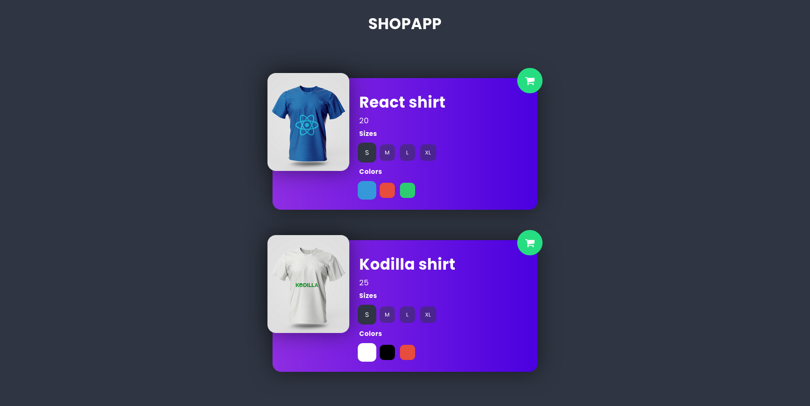

# Product Personalizer (ShopApp)

An interactive React-based product customization app. Users can select product sizes, colors, and view real-time updates for each item (e.g., React and Kodilla t-shirts).

[Live Demo](https://product-personalizer-ochre.vercel.app/)

## Preview


## Features
- React component-based UI
- Product cards with image, size, and color selection
- Dynamic styling using SCSS
- Responsive layout
- Add-to-cart button (UI only)

##  Tech Stack
- React
- SCSS Modules
- Create React App
  
## Installation

```bash
git clone https://github.com/cayceworld/product-personalizer.git
cd product-personalizer
yarn install
yarn start

